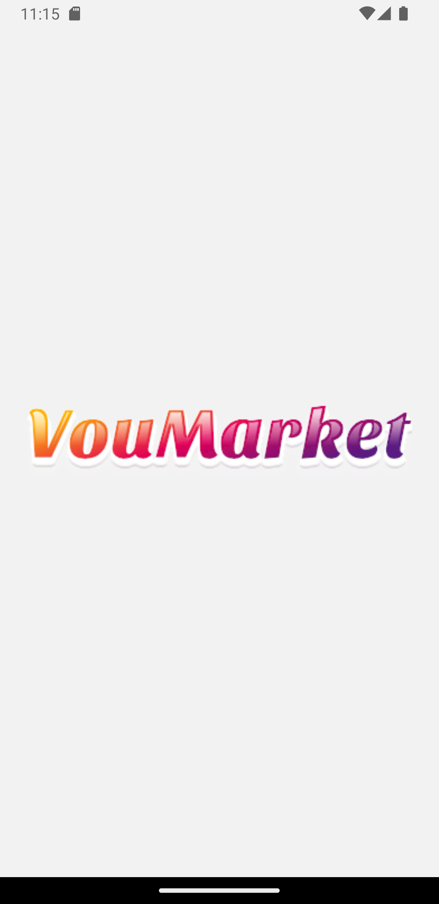
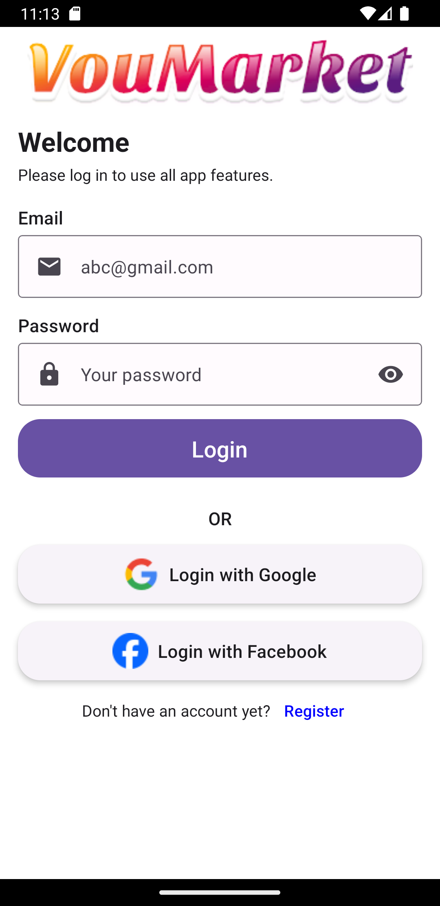
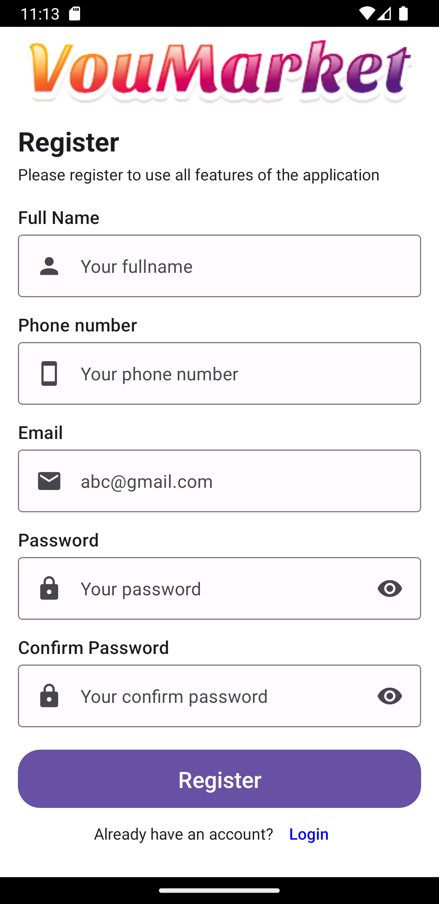
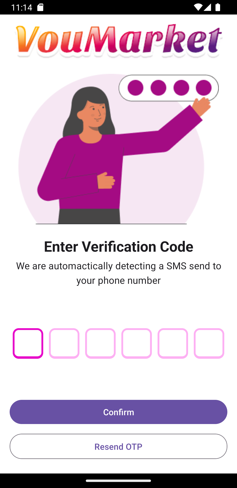

# VOU Marketing with Realtime Games

## 📋 Table of Contents
1. [Run on Android Virtual Device (AVD)](#run-on-android-virtual-device-avd)
   1. [Config .env file](#️config-env-file)
   2. [Installation](#installation)
      1. [Prerequisites](#1-prerequisites)
      2. [Run the Project](#2-run-the-project)
      3. [Run on Android Virtual Device (AVD)](#3-run-on-android-virtual-device-avd)
2. [Run on Mobile Device (real device)](#run-on-mobile-device-real-device)
   1. [Using ngrok to Expose server localhost:8080](#using-ngrok-to-expose-server-localhost8080)
      1. [Install ngrok](#1-install-ngrok)
      2. [Connect Your ngrok Account](#2-connect-your-ngrok-account-optional-but-recommended)
      3. [Start ngrok](#3-start-ngrok)
      4. [Get the Public URL](#4-get-the-public-url)
   2. [Config .env file](#️config-env-file-1)
   3. [Installation](#installation-1)
      1. [Prerequisites](#1-prerequisites-1)
      2. [Run the Project](#2-run-the-project-1)
      3. [Run on Mobile Device](#3-run-on-mobile-device)
3. [Project Showcase](#️project-showcase)


## 🧑‍💻 Run on Android Virtual Device (AVD) <a name="run-on-android-virtual-device-avd"></a>

### ⚙️ Config .env file <a name="config-env-file"></a>

To ensure that the API and WebSocket connections work properly, you need to set up the IP address in the [.env]() file in root dir with path `./.env`. Follow these steps:

1. Open Command Prompt and run the following command to get your IPv4 address:
```bash
ipconfig
```
2. Locate the IPv4 address of the network you are connected to (e.g., `192.168.1.x`).

3. In the root directory of the project, create or open the `.env` file with the path `./.env`.

4. Add this IPv4 address to the `API_URL` and `WEBSOCKET_URL` environment variables as follows:
```bash
API_URL=http://<your-IPv4-address>:8080/v1
WEBSOCKET_URL=ws://<your-IPv4-address>:8080/v1/notify
```

### 📦 Installation <a name="installation"></a>

#### 1. Prerequisites
Ensure `yarn` is installed globally on your system. If not, install it using:

```bash
npm install -g yarn
```

Intall packages & dependencies
```bash
yarn install
```

#### 2. Run the Project

```bash
yarn start --reset-cache
```

#### 3. Run on Android Virtual Device (AVD)
To launch the app on an Android emulator (recommended with Android Studio), press:
```bash
a
```

## 📱 Run on Mobile Device (real device) <a name="run-on-mobile-device-real-device"></a>

### 🌐 Using ngrok to Expose server `localhost:8080` <a name="using-ngrok-to-expose-server-localhost8080"></a>

To make your local server accessible over the internet, you can use [ngrok](https://ngrok.com/). Follow these steps to expose `localhost:8080`:

#### 1. Install ngrok
If you haven’t installed ngrok yet, download it from the [official website](https://ngrok.com/download). Follow the installation instructions specific to your operating system.

#### 2. Connect Your ngrok Account (Optional but Recommended)
Connecting your ngrok account allows you to access additional features like custom subdomains and extended session durations. Follow these steps:

- Go to the [ngrok dashboard](https://dashboard.ngrok.com/get-started/your-authtoken) and sign up or log in.

- In your dashboard, copy your auth token from the `Your Authtoken` section.

- Run the following command in your terminal (`ngrok.exe`) to add the token to your ngrok configuration:
```bash
ngrok config add-authtoken <your-auth-token>
```
Replace `<your-auth-token>` with the token you copied from the ngrok dashboard.

#### 3. Start ngrok
Once installed, open a terminal (`ngrok.exe`) and start ngrok with the following command:

```bash
ngrok http http://localhost:8080
```

#### 4. Get the Public URL
After running the command, ngrok will display output similar to this:

```bash
Forwarding                    https://abcd1234.ngrok-free.app -> http://localhost:8080
```

Copy the generated URL (e.g., `https://abcd1234.ngrok-free.app`). This URL is now publicly accessible and will forward requests to your local server on port 8080.

### ⚙️ Config .env file <a name="config-env-file-1"></a>

If your project uses environment variables, you can set `API_URL` and `WEBSOCKET_URL` in your [.env]() file to use the ngrok URL:

```bash
API_URL=https://abcd1234.ngrok-free.app/v1
WEBSOCKET_URL=ws://abcd1234.ngrok-free.app/v1/notify
```
    
> **_NOTE:_**  Each time you restart ngrok, a new URL will be generated, so you'll need to update the URLs in your `.env` file accordingly.

### 📦 Installation <a name="installation-1"></a>

#### 1. Prerequisites
Ensure `yarn` is installed globally on your system. If not, install it using:

```bash
npm install -g yarn
```

Intall packages & dependencies
```bash
yarn install
```

#### 2. Run the Project

```bash
npx expo start --tunnel
```
> **_NOTE:_** If you get the error $${\color{red}CommandError:\space ngrok\space tunnel\space took\space too\space long\space to\space connect}$$. Try running this command again until it succeeds

#### 3. Run on Mobile Device

- Open **Expo Go** and scan the displayed QR code.

  *If scanning doesn't work, enter the displayed URL manually in the Expo Go app.*


## ⚡️ Project Showcase <a name="project-showcase"></a>

|  	|  	|  	|  	|  	|
|---	|---	|---	|---	|---	|
| |||||